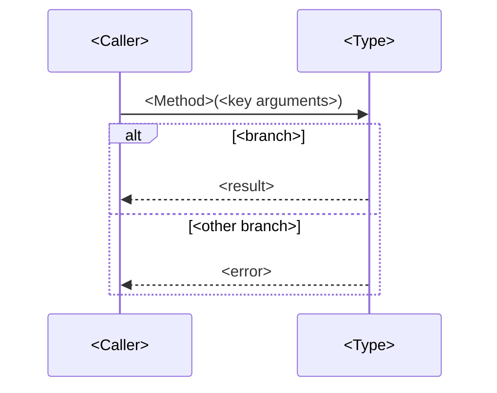

# <Component> — flows

## <Flow name>

<One sentence: when this flow runs and what it produces.>

```mermaid
sequenceDiagram
  participant C as <Caller>
  participant X as <Type>
  C->>X: <Method>(<key arguments>)
  alt <branch>
    X-->>C: <result>
  else <other branch>
    X-->>C: <error>
  end
```

<Notes the diagram cannot carry: ordering dependencies, what is skipped on failure.>
